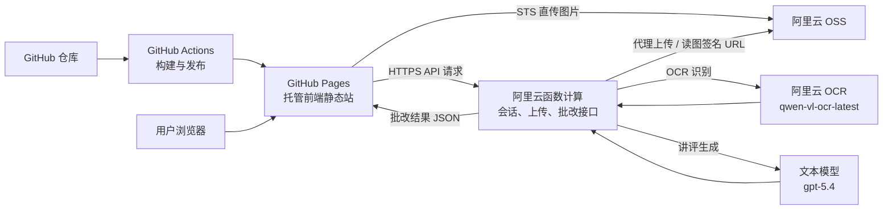
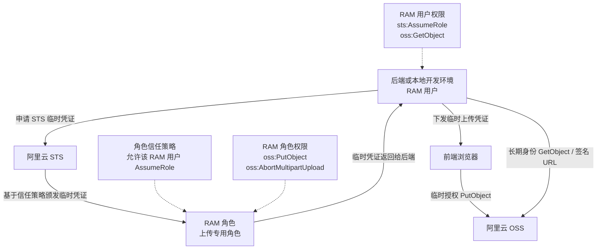
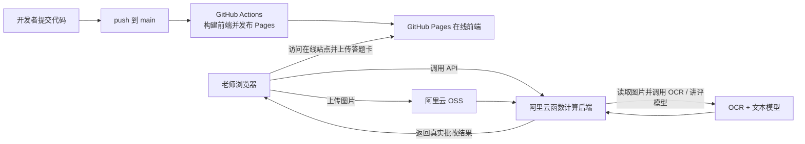

# 用 GitHub Pages + 阿里云，我低成本上线了一个真实可用的 AI 网站

如果你现在正在做 AI 产品，尤其是一个还在验证阶段的网站，十有八九会遇到一个很现实的问题：产品还没跑通，基础设施的复杂度已经先起来了。有人一上来就买服务器、配域名、装 Nginx、跑容器、搭数据库、接对象存储，最后钱和时间都花了不少，真正能让用户体验的那条 AI 链路却还没完全打通。

但对大多数 AI MVP 来说，最重要的不是“架构看起来有多完整”，而是能不能以足够低的成本，把一个真实可用的网站先上线。这里的“真实可用”不是指页面能点、按钮会动、结果像模像样，而是指它真的能接收用户输入、真的能上传文件、真的能调用模型、真的能返回业务结果。

这次我们把一个 AI 作业批改网站真正发布上线，用的就是一套非常适合 MVP 的轻量组合：前端放在 GitHub Pages，后端放在阿里云函数计算，图片放在阿里云 OSS，上传通过 STS 临时凭证控制，识别走阿里云 OCR，讲评生成走文本大模型。最终跑通的不是一个“静态演示页”，而是一条完整真实的线上链路：用户打开网站，输入邀请码，上传答题卡，系统把图片传到 OSS，再调用真实 AI 模型识别和讲评，最后返回真实批改结果。

这套方案最有价值的地方，在于它同时满足了三件事：第一，真的能上线；第二，真的能跑真实 AI；第三，前期固定成本很低。也正因为这样，它特别适合公众号里经常会提到的那类问题：“我想先做一个 AI 网站验证产品，但不想一开始就上重架构，应该怎么部署？”

[配图1：网站首页最终效果图]

这套方案最值得写出来的地方，不是“我们也接了 AI”，而是它证明了一件事：一个 AI 网站并不一定要靠重资产架构才能上线。只要把前端托管、后端执行、对象存储、权限隔离和模型调用几件事情拆开想清楚，就能用很低的固定成本，搭出一个真实可用的线上系统。

## 为什么是 GitHub Pages + 阿里云函数计算

我们先看最核心的设计决策。前端之所以选 GitHub Pages，原因很简单：静态站点发布足够省心。Vite 构建完成后就是一套静态文件，天然适合走 Pages。只要仓库配置好 Actions，代码 push 到 `main` 后就能自动构建并发布，不需要你自己维护 Nginx、证书、服务器或者对象存储静态托管规则。对于产品首页、演示页、营销落地页这种以前端展示为主的 AI 网站来说，这个托管方式几乎就是低摩擦起步的最佳选项。

后端之所以选阿里云函数计算，而不是先买一台云服务器，原因也同样务实。AI 网站的后端早期通常不是高并发的长连接系统，而是一些典型的请求型动作：签发会话、生成上传凭证、接收上传回退、读取 OSS 图片、调用模型、返回结果。这类请求天然适合函数计算。函数按量付费，不需要长期维持一台机器在线，前期没有稳定流量的时候，成本会比传统常驻服务更友好。

对象存储则必须独立出来。因为 AI 网站只要涉及图片、文档、音频，最终都绕不开一个持久化文件载体。把图片先落到 OSS，后端再去读图并调用 OCR，是比“浏览器直接把 Base64 传后端，后端再层层转发”更接近真实生产的做法。这样链路清晰，排障也更容易。

## 这套架构到底解决了什么问题

如果你只是做一个 AI Demo 页面，其实完全可以用假数据把页面跑起来。但只要你想做真实产品，很快就会遇到三个现实问题。

第一个问题，是前端怎么稳定上线。很多项目卡在这里，不是因为页面写不出来，而是因为没有一个低门槛、自动化、可持续的发布方式。GitHub Pages 很好地解决了这个问题。前端代码一旦能被构建成静态产物，发布这件事就可以被极大简化。

第二个问题，是后端怎么在低成本前提下支持真实 AI 调用。如果你只是调一个文本接口，甚至可以全前端化；但只要涉及密钥保护、文件上传、对象存储、签名 URL、会话机制、人机校验，后端就不可避免。函数计算的价值就在这里，它不要求你先养一台服务器，却能承接这些真实的后端职责。

第三个问题，是 AI 模型怎么拿到文件。绝大多数“假打通”的 AI 网站，问题都出在这里。页面可以上传一张图，但这张图究竟有没有被安全存储、后端能不能访问、模型读图链接是不是有效、权限是不是只给到了该给的人，这些问题在演示阶段很容易被忽略，但一上线就会暴露。OSS + STS 的组合，恰好能把这一段链路做成真实且相对规范的结构。

## 前端部署：GitHub Pages 的价值不只是“免费”

很多人提 GitHub Pages，第一反应是“免费托管静态网站”。但在这次项目里，它更重要的价值其实是：发布动作足够标准化。

我们前端使用的是 Vite，构建后输出 `dist/`。接着用 GitHub Actions 里的 Pages 工作流去接管构建和发布。这样一来，整个流程会变成一种非常明确的工程节奏：本地开发、提交代码、push 到 `main`、自动构建、自动发布。没有手工上传压缩包，没有记忆式操作，没有“这次我忘了替换文件”的人为风险。

真正踩坑的地方也有，而且很典型。GitHub Actions 里的 `deploy-pages` 如果直接报 404，往往不是 workflow 写错了，而是仓库本身还没有启用 Pages。也就是说，代码和 CI 都准备好了，但仓库级的 Pages 服务没打开。这种问题不复杂，却很容易卡人半天。正确做法是在仓库 `Settings > Pages` 里把 `Source` 设为 `GitHub Actions`。这个动作一旦做完，后面再 push 代码，Pages 的发布链路才会真正生效。

另一个容易忽略的问题，是路径问题。GitHub Pages 的仓库站点不是挂在域名根路径，而是通常挂在 `/<repo-name>/` 这样的子路径下。如果前端里把静态资源或者下载链接写成绝对根路径，比如 `/test-sheets/demo.png`，那在本地看可能没问题，到了 Pages 上就会失效，因为它会去找域名根上的资源，而不是仓库子路径里的资源。这个坑在移动端上尤其容易表现成“点击没反应”。最后我们把演示答题卡链接改成相对路径，才真正解决了线上访问问题。

[配图3：GitHub Pages 设置页与 Actions 发布页截图]

## 后端部署：函数计算不是“阉割版后端”，而是 MVP 的正确姿势

这次项目的后端不是一个摆设 API，而是真正在干活。它要负责会话签发、邀请码校验、上传策略下发、OSS 代理上传回退、读取对象存储中的图片、调用 OCR 模型、调用文本模型、最后返回真实的批改结果。也就是说，它承载的是一条完整业务链路，而不是一个简单的“透传接口”。

这类后端其实非常适合函数计算。因为它的执行方式就是典型的请求触发型：有请求时执行，没有请求时不占常驻资源。对于早期 AI 网站来说，这比长期维护一台云服务器更轻。尤其是当你的网站还处在产品验证期，用户量和访问模式都不稳定的时候，函数计算的按量付费就显得很合理。

不过，函数计算也不是“把 Node 项目扔上去就能跑”。我们在发布过程中碰到的一个关键问题，是入口协议和打包方式。最开始后端本地跑得好好的，但一发到云函数，公网健康检查就是 502。继续往下查才发现，问题不是业务逻辑挂了，而是函数入口没有按平台要求适配。后来我们重新对齐了函数的 HTTP event 处理方式，才把这一层跑通。

再往后，又遇到一个更隐蔽的问题：函数能启动了，但运行时找不到 `ali-oss` 依赖。换句话说，本地项目虽然能运行，部署包却没有把真正需要的运行期依赖带全。这个问题的根因也很典型：本地 Node 项目和云函数部署产物，并不是一回事。最后我们没有继续赌平台的默认打包行为，而是明确生成函数专用的 bundle 产物，再把 `handler` 指向 bundle 入口。这样，云函数运行时到底加载哪个文件，就完全可控了。

[配图4：阿里云函数计算配置页、直调日志与 502 排查过程截图]

## 文件上传：为什么一定要用 OSS + STS，而不是把图片直接发给后端

AI 网站一旦涉及图片上传，就会进入工程复杂度明显上升的阶段。因为这时你面对的不只是一个前端文件选择框，而是一整套安全与链路问题：上传给谁、谁有权限写入、谁有权限读取、读取给模型时是否会泄露长期密钥、浏览器直传失败时怎么兜底。

如果把所有图片都直接发给后端，再由后端长期持有 AK/SK 去写 OSS，虽然简单，但不够优雅，也会把服务端压得更重。更好的方式，是让前端先向后端申请 STS 临时凭证，再用短时授权去完成上传。这样前端不直接接触长期密钥，服务端也只负责发放临时上传权限。

当然，这条链路并不是第一次就会顺。我们在权限配置上踩了不少坑。RAM 用户、RAM 角色、`sts:AssumeRole`、`oss:PutObject`、`oss:GetObject`、信任策略，这些东西一旦主体配错，报错信息又往往很抽象。后来梳理下来，其实逻辑并不复杂：本地开发和服务端调用依赖一个 RAM 用户，它负责申请 STS、读取 OSS 对象；前端上传依赖另一个 RAM 角色，它通过服务端发放的临时凭证来写入对象存储。把两个身份分清楚，权限问题才开始变得可控。

更现实的一点是，浏览器直传并不总是稳定。即便 OSS 配好了，也可能因为 CORS 或预检在某些浏览器、某些设备上失败。为了不让整条产品链路被浏览器问题卡死，我们最后做了一个很务实的兜底：前端优先尝试直传，如果失败，就自动回退到后端代理上传，再由后端写入真实 OSS。对于 MVP 来说，这种“优先走最优路径，但保留可靠回退”的设计，比一味追求某一种理想链路更重要。

## 为什么这套方案特别适合“一个人先把 AI 产品做出来”

这篇文章真正想讲的，不只是“怎么部署”，而是“什么样的部署方式更适合 AI MVP”。如果你是一个人或者一个很小的团队，想先把产品上线验证，而不是先搭一个复杂平台，那么这套组合有几个非常现实的优势。

第一，前端固定成本很低。GitHub Pages 几乎把静态站点托管这件事压到了最低摩擦。只要代码在 GitHub 上，发布动作天然就可以被工作流接管。

第二，后端没有常驻服务器成本。函数计算意味着你不需要为了一个每天几十个请求的 MVP，先背上一台长期开机的服务器。请求来了再执行，请求少的时候成本自然也低。

第三，对象存储和模型调用可以独立扩展。你不需要先设计出“大而全”的统一平台。上传、读取、OCR、讲评，本来就是四段可以独立调试的链路。把它们拆开以后，问题更容易定位，后续也更容易替换单点能力。

第四，整套架构足够真实。它不是那种“能演示、不能上线”的伪系统，而是已经具备真实业务路径的系统。只要你后面愿意继续迭代，比如增加老师后台、历史任务、结果复盘、更多题型支持，这些能力都可以在这套基础上继续长出来。

## 这套方案最适合什么样的项目

如果你的 AI 网站符合下面这些特点，那么这套组合大概率很适合你：

1. 前端主要是展示、表单、上传、结果页，不需要复杂的 SSR。
2. 后端主要是请求型动作，而不是高并发长连接服务。
3. 文件类输入比较多，比如图片、音频、文档。
4. 产品还在验证阶段，用户量有限，但你又希望它是真链路而不是假演示。
5. 你希望控制成本，同时把工程路径走对。

反过来说，如果你的系统已经进入高并发业务阶段，或者需要复杂的实时状态管理、长连接、数据库事务密集写入，那就应该考虑更完整的后端部署体系了。但在产品验证期，过早上重架构，往往不是技术领先，而是工程浪费。

## 最后的结论：低成本，不等于低质量

很多人会把“低成本部署”误解成“随便搭一下”。但这次项目真正证明的是，低成本和高质量并不矛盾。真正重要的不是你花了多少钱买基础设施，而是你是否把关键链路做成了真实、可排障、可持续迭代的结构。

GitHub Pages 解决的是前端发布问题，阿里云函数计算解决的是低门槛后端执行问题，OSS + STS 解决的是文件与权限问题，真实多模态模型解决的是识别与生成问题。这几块拼起来，就足以支撑一个 AI 网站在 MVP 阶段稳定上线。它当然不是最终形态，但它是一条非常合理、非常务实的起跑线。

如果后面要把这篇内容发成公众号，我会建议标题就围绕一个核心卖点展开：不是“我们用了什么模型”，而是“我们怎样用很低的固定成本，把一个真实可用的 AI 网站发布上线”。因为对于很多正在做 AI 产品的人来说，这个问题比模型名字更重要，也更有现实参考价值。

